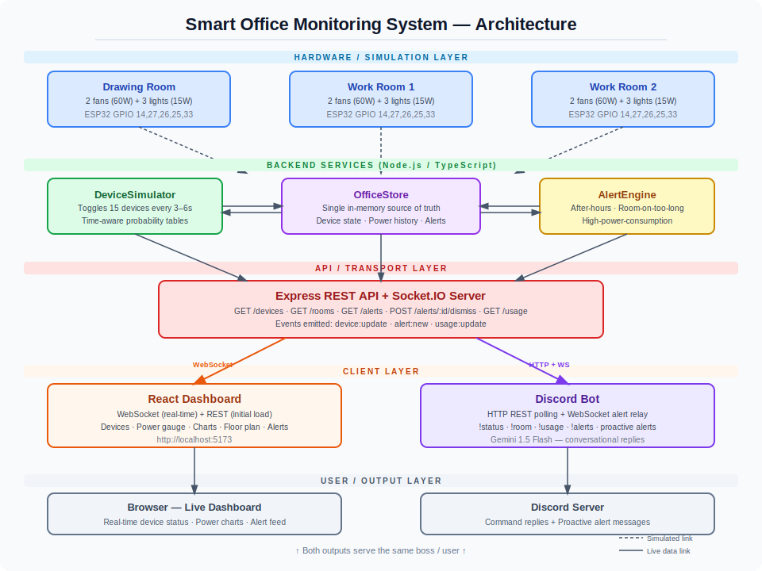

# Smart Office Monitoring System

A real-time office device monitoring system with a live web dashboard and Discord bot. Built for **IUT Datathon / Techhathon Nationals** — Lights, Fans, Discord: The Boss's Big Idea.

---

## Architecture

```
[DeviceSimulator]
      │  toggles 15 simulated devices every 3–6 s
      ▼
[OfficeStore]  ←→  [AlertEngine]
      │                  │ device-on-after-hours
      │                  │ room-on-too-long
      │                  │ high-power-consumption
      ▼
[Express REST API + Socket.IO]  (port 4000)
      │                │
      ▼                ▼
[React Dashboard]  [Discord Bot]
  WebSocket         HTTP polling
  live updates    + WebSocket alerts
```

### Office layout
- **3 rooms**: Drawing Room, Work Room 1, Work Room 2
- **5 devices per room**: 2 fans (60 W each) + 3 lights (15 W each)
- **15 devices total** — max theoretical draw: **495 W**

---

## Project Structure

| Folder | Description |
|---|---|
| [backend](backend) | Express + Socket.IO API, in-memory store, device simulator, alert engine |
| [frontend](frontend) | React + Vite dashboard with real-time charts, floor plan, and alerts |
| [bot](bot) | Discord bot — commands + proactive alert relay, Gemini-powered replies |
| [shared](shared) | Shared TypeScript types (single source of truth for domain types) |

---

## Prerequisites

- Node.js 20 or newer
- npm
- A Discord bot token (create at [discord.com/developers](https://discord.com/developers/applications))
- A Google Gemini API key ([aistudio.google.com](https://aistudio.google.com/apikey)) — optional but strongly recommended for conversational bot responses

---

## Setup

### 1. Install all dependencies (one command)

```bash
npm run setup
```

This builds the shared types package first, then installs backend, frontend, and bot in sequence.

### 2. Configure environment variables

Copy the example files and fill in your values:

```bash
cp backend/.env.example  backend/.env
cp frontend/.env.example frontend/.env
cp bot/.env.example      bot/.env
```

Edit `bot/.env` and set at minimum:
- `DISCORD_BOT_TOKEN` — from [discord.com/developers](https://discord.com/developers/applications)
- `GEMINI_API_KEY` — from [aistudio.google.com](https://aistudio.google.com/apikey) (free)
- `ALERT_CHANNEL_ID` — Discord channel ID for proactive alert messages

# frontend
cp frontend/.env.example frontend/.env

# bot
cp bot/.env.example bot/.env
```

---

## Running the System

### Option A — One command (recommended)

```bash
npm run dev
```

Starts backend, frontend, and bot **concurrently** with colour-coded log prefixes.
The dashboard opens at **http://localhost:5173**.

> Make sure all three `.env` files are filled in before running.

### Option B — Separate terminals (useful for debugging)

```bash
# Terminal 1 — backend
cd backend && npm run dev

# Terminal 2 — frontend
cd frontend && npm run dev

# Terminal 3 — bot
cd bot && npm run dev
```

---

## Environment Variables

### Backend — `backend/.env`

| Variable | Default | Description |
|---|---|---|
| `PORT` | `4000` | HTTP server port |
| `CORS_ORIGIN` | `http://localhost:5173` | Allowed dashboard origin |
| `SIMULATOR_MIN_INTERVAL_MS` | `3000` | Min device simulator tick (ms) |
| `SIMULATOR_MAX_INTERVAL_MS` | `6000` | Max device simulator tick (ms) |
| `SIMULATOR_INITIAL_DELAY_MS` | `1000` | Delay before simulator starts (ms) |

### Frontend — `frontend/.env`

| Variable | Default | Description |
|---|---|---|
| `VITE_API_URL` | `http://localhost:4000` | Backend REST API base URL |
| `VITE_SOCKET_URL` | `http://localhost:4000` | Backend Socket.IO URL |

### Bot — `bot/.env`

| Variable | Required | Description |
|---|---|---|
| `DISCORD_BOT_TOKEN` | ✅ | Discord bot token from the developer portal |
| `DISCORD_GUILD_ID` | optional | Test guild ID for slash-command registration |
| `BACKEND_API_URL` | `http://localhost:4000` | Backend REST API URL |
| `BACKEND_SOCKET_URL` | `http://localhost:4000` | Backend Socket.IO URL for alert relay |
| `COMMAND_PREFIX` | `!` | Prefix for bot commands |
| `ALERT_CHANNEL_ID` | optional | Discord channel ID for proactive alert messages |
| `GEMINI_API_KEY` | optional | Google Gemini API key for conversational replies |

---

## Discord Bot Commands

| Command | What it does |
|---|---|
| `!status` | Office-wide device summary across all 3 rooms |
| `!room drawing` | Status of the Drawing Room |
| `!room work1` | Status of Work Room 1 |
| `!room work2` | Status of Work Room 2 |
| `!usage` | Current power draw (W) and estimated daily consumption (kWh) |
| `!alerts` | Top 5 active alerts |

All responses are passed through **Gemini 1.5 Flash** for friendly, conversational phrasing (falls back to plain text if `GEMINI_API_KEY` is not set).

The bot also **proactively posts** to the configured alert channel whenever an alert is triggered.

---

## Alert Types

| Type | Trigger |
|---|---|
| `device-on-after-hours` | A device turns ON outside office hours (before 9 AM or after 5 PM) |
| `room-on-too-long` | All devices in a room have been ON continuously for more than 2 hours |
| `high-power-consumption` | Total office draw exceeds 85% of max capacity (≥ 421 W / 495 W) |

---

## API Reference

### REST endpoints

| Method | Path | Description |
|---|---|---|
| `GET` | `/health` | Service status |
| `GET` | `/devices` | All 15 devices (filterable by room, type, status) |
| `GET` | `/rooms` | 3 room summaries with live power and device counts |
| `GET` | `/alerts` | Active alerts (pass `?active=false` for all) |
| `POST` | `/alerts/:id/dismiss` | Dismiss an alert |
| `GET` | `/usage` | Current watts, estimated kWh today, and power history |

### Socket.IO events (client ← server)

| Event | Payload |
|---|---|
| `device:update` | `DeviceRecord` — a device's state just changed |
| `alert:new` | `AlertRecord` — a new alert was triggered |
| `usage:update` | `UsageSnapshot` — latest power consumption sample |

---

## Diagrams

## Diagrams

### System Architecture Diagram



> Full data-flow: `Office Devices → DeviceSimulator → OfficeStore ↔ AlertEngine → Express API + Socket.IO → React Dashboard (WebSocket) + Discord Bot (HTTP + WS)`

### Hardware / Electrical Schematic (Wokwi)
The ESP32 circuit for one representative room is in [`docs/wokwi/`](docs/wokwi/):
- [`docs/wokwi/diagram.json`](docs/wokwi/diagram.json) — import directly into [wokwi.com](https://wokwi.com)
- [`docs/wokwi/sketch.ino`](docs/wokwi/sketch.ino) — Arduino firmware (paste into Wokwi's code editor)
- [`docs/wokwi-plan.md`](docs/wokwi-plan.md) — full wiring guide, pin mapping, and electrical reasoning

Circuit covers: ESP32 + 5 relay-simulated LEDs (Fan1=GPIO14, Fan2=GPIO27, Light1=GPIO26, Light2=GPIO25, Light3=GPIO33) + ACS712 current sensor (potentiometer on GPIO34) + push button (GPIO0).

---

## Video Demo

> 🎥 **[Watch the demo on Google Drive](https://drive.google.com/drive/folders/1C8hBTlZiUl3VOT6sdjvaUPc38wtIaKRo?usp=sharing)**
